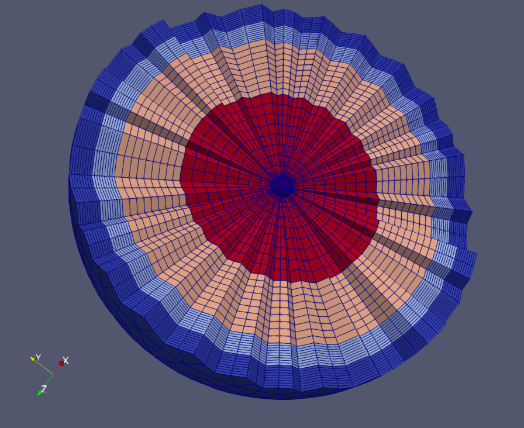

#GeodHoneyComb module

This module provides algorithsm to generate hexahedral meshes for spherical shapes using
a pattern based on honeycombs.

The usage is depicted by the unit tests given in unit test files (see **geodHoneyComb/tst/GeodHoneyCombTestSuite.h** for examples). In the following code snippet, we use the class **GeodHexMesher** to generate a sphere with 3 layers of
of cells. The sphere is centered at origin and is radius values 1. We use a uniform discretization for all  layers including the central one which contains pyramidal cells in the center.

```cpp
//creation of the meshing algorithm
GeodHexMesher ghm;
ghm.setCenter(math::Point(0,0,0));
ghm.setRadius(1);

//layers are created with a uniform discretization for all of them
math::DiscretizationScheme1DUniform d(math::Point(0,0,0), math::Point(1,0,0), 10);
auto layer0 = std::make_pair(0., &d); //inner radius being at 0 means we will have a whole sphere
auto layer1 = std::make_pair(0.5, &d);
auto layer2 = std::make_pair(0.8,&d);
auto layer3 = std::make_pair(0.9,&d);
std::map<double, math::DiscretizationScheme1D*> layers;
layers.insert(layer1);
layers.insert(layer2);
layers.insert(layer3);
layers.insert(layer0);
ghm.setLayerData(layers);

// execution of the algorithm
GeodHexMesher::OpResult res = ghm.execute();

//if the algorithm succeeded, we can access to the produced mesh
if(res == GeodHexMesher::GEOD_SUCCESS)
    std::unique_ptr<Mesh> m = ghm.getMesh();
```

We get the following resulting mesh with one color per layer.

